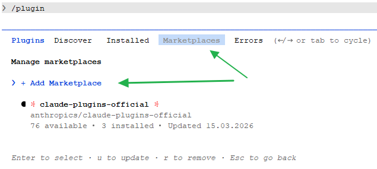
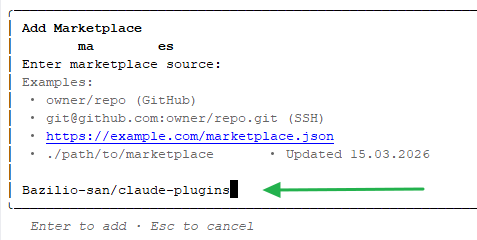
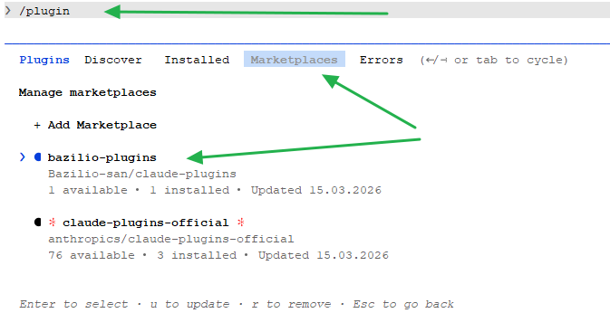
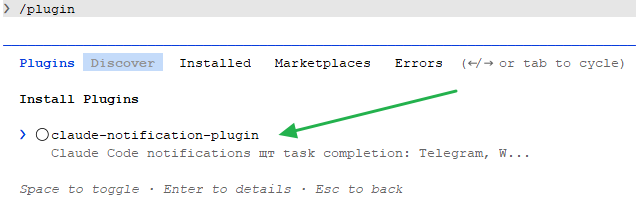
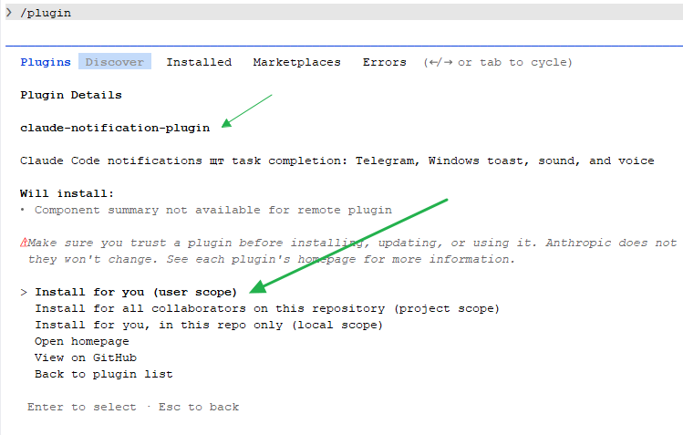
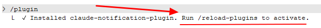
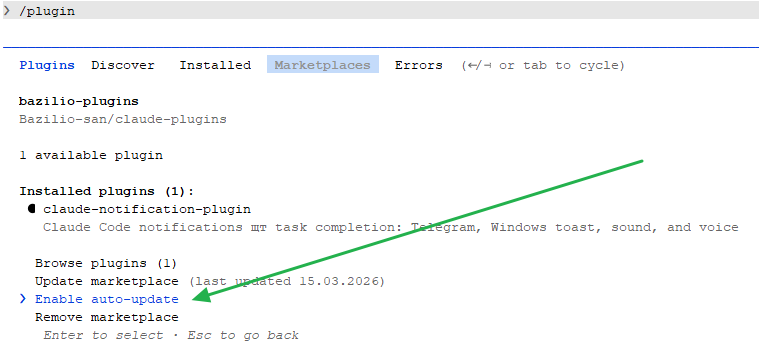
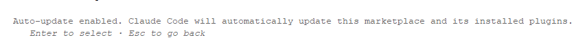
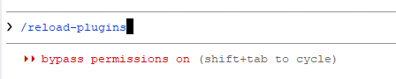
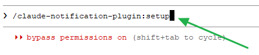

# Installing via Claude Code Plugin Marketplace

Step-by-step visual guide for adding the marketplace and installing the plugin through the Claude Code UI.

## Step 1: Open the Plugin Manager

Type `/plugin` in Claude Code and navigate to the **Marketplaces** tab. Click **+ Add Marketplace**.



## Step 2: Add the Marketplace

Enter the marketplace source:

```
Bazilio-san/claude-plugins
```

Press **Enter** to add.



## Step 3: Marketplace Added

The **bazilio-plugins** marketplace now appears in the list.



## Step 4: Find the Plugin

Switch to the **Discover** tab. Select **claude-notification-plugin**.



## Step 5: Review Plugin Details

Review the plugin description and available actions.



## Step 6: Install the Plugin

Select **Install for you (user scope)**.



## Step 7: Enable Auto-Update (recommended)

Go back to the **Marketplaces** tab, select **bazilio-plugins**, then choose **Enable auto-update**.





## Step 8: Reload Plugins

Run `/reload-plugins` to activate the newly installed plugin.



## Step 9: Configure Telegram

Run the setup command to enter your Telegram bot token and chat ID:

```
/claude-notification-plugin:setup
```



See [Telegram Setup](README.md#telegram-setup) in the README for how to get your bot token and chat ID.
